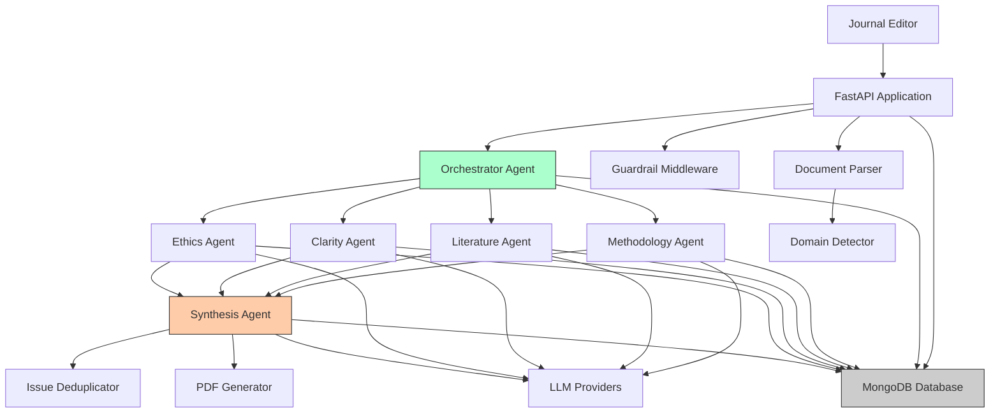
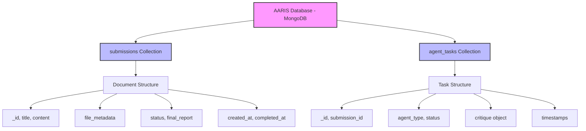
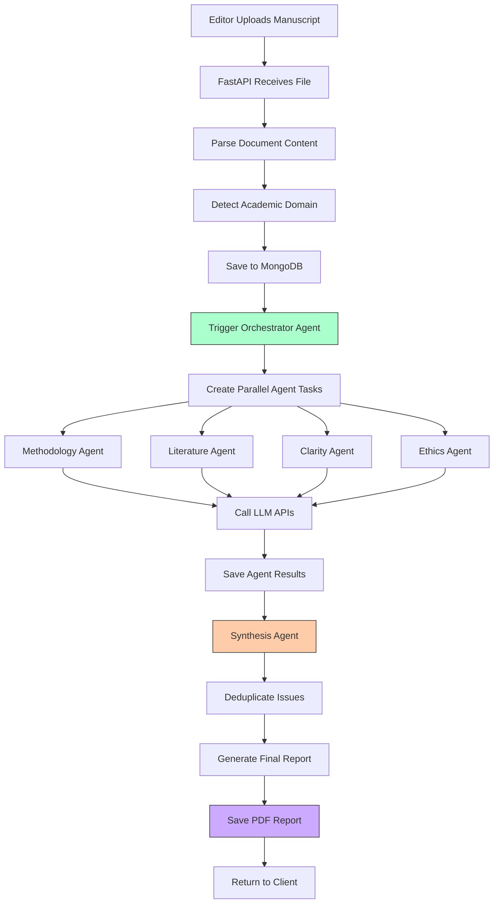
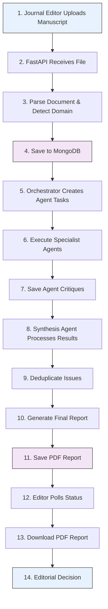

# Academic Agentic Review Intelligence System (AARIS)

[](https://python.org)
[](https://fastapi.tiangolo.com)
[](https://mongodb.com)
[](LICENSE)

An advanced AI-powered system for comprehensive academic manuscript review using multi-agent architecture. AARIS combines specialized AI agents to provide structured, domain-aware analysis of academic papers across 21+ disciplines.

## ⚠️ Important Disclaimer

**HUMAN OVERSIGHT REQUIRED**: This system provides preliminary AI-generated reviews only. Human expert validation is mandatory before any editorial decisions. Do not use for final publication decisions without qualified human reviewer approval.

## 🚀 Key Features

### Multi-Agent Architecture

- **Orchestrator Agent**: Coordinates the entire review process
- **Specialist Agents**: Methodology, Literature Review, Clarity, Ethics
- **Synthesis Agent**: Compiles comprehensive final reports
- **Domain Detection**: Automatically identifies academic discipline (21+ domains)

### Advanced Capabilities

- **Domain-Aware Reviews**: Tailored criteria for each academic field
- **Issue Deduplication**: Eliminates redundant findings across agents
- **Guardrails System**: Ensures ethical and professional output
- **PDF Generation**: Professional, formatted review reports
- **Multi-LLM Support**: OpenAI, Anthropic, Google Gemini, Groq

### Supported Academic Domains

- Medical & Biomedical Sciences
- Computer Science & Engineering
- Psychology & Social Sciences
- Biology & Bioinformatics
- Physics & Chemistry
- Mathematics & Statistics
- Economics & Business
- Law & Political Science
- Philosophy & Linguistics
- Environmental Science & Education
- Anthropology

## 🏗️ System Architecture

### High-Level Architecture



### Data Flow Architecture



### Process Flow Diagram



### User Flow Diagram



## 📋 Prerequisites

- Python 3.11+
- MongoDB (local or Atlas)
- LLM API keys (at least one):
  - OpenAI API key
  - Anthropic API key
  - Google Gemini API key
  - Groq API key

## 🛠️ Installation

### 1. Clone Repository

```bash
git clone https://github.com/your-repo/academic-journal-reviewer.git
cd academic-journal-reviewer
```

### 2. Create Virtual Environment

```bash
python -m venv .venv
source .venv/bin/activate  # On Windows: .venv\Scripts\activate
```

### 3. Install Dependencies

```bash
pip install -r requirements.txt
```

### 4. Environment Configuration

Create `.env` file:

```env
# MongoDB Configuration
MONGODB_URL=mongodb://localhost:27017
MONGODB_DATABASE=aaris

# LLM API Keys (configure at least one)
DEFAULT_LLM=openai
OPENAI_API_KEY=your_openai_api_key_here
ANTHROPIC_API_KEY=your_anthropic_api_key_here
GEMINI_API_KEY=your_gemini_api_key_here
GROQ_API_KEY=your_groq_api_key_here

# Application
APP_ID=aaris-app
```

### 5. Start MongoDB

```bash
# Local MongoDB
mongod

# Or use MongoDB Atlas (cloud)
# Update MONGODB_URL in .env with your Atlas connection string
```

### 6. Run Application

```bash
uvicorn app.main:app --reload --host 0.0.0.0 --port 8000
```

## 📚 API Documentation

### Base URL

```plain-text
http://localhost:8000
```

### Interactive API Docs

- **Swagger UI**: [http://localhost:8000/docs](http://localhost:8000/docs)
- **ReDoc**: [http://localhost:8000/redoc](http://localhost:8000/redoc)

### Key Endpoints

#### Upload Manuscript

```http
POST /api/v1/submissions/upload
Content-Type: multipart/form-data

file: manuscript.pdf (or .docx)
```

*Initiates LangGraph workflow with parallel agent processing*

#### Get Review Status

```http
GET /api/v1/submissions/{submission_id}/status
```

#### Get Final Report

```http
GET /api/v1/submissions/{submission_id}/report
```

#### Download PDF Report

```http
GET /api/v1/submissions/{submission_id}/download
```

#### System Disclaimer

```http
GET /disclaimer
```

#### LangGraph System Status

```http
GET /api/v1/system/langgraph-status
```

*Check LangGraph and LangChain integration status*

## 🔧 Configuration

### LLM Provider Selection

Set `DEFAULT_LLM` in `.env`:

- `openai` - OpenAI GPT models
- `anthropic` - Claude models
- `gemini` - Google Gemini
- `groq` - Groq models

### Domain-Specific Weights

The system automatically adjusts review criteria based on detected domain:

- **Medical**: Methodology (40%), Ethics (30%)
- **Computer Science**: Methodology (40%), Clarity (30%)
- **Mathematics**: Methodology (50%), Clarity (30%)
- **Law**: Literature (40%), Clarity (25%)

## 📊 Review Process Flow

1. **Document Upload**: PDF/DOCX parsing and content extraction
2. **Domain Detection**: Automatic identification of academic field
3. **Agent Orchestration**: Parallel execution of specialist agents
4. **Methodology Analysis**: Research design, statistical methods
5. **Literature Review**: Citation analysis, theoretical framework
6. **Clarity Assessment**: Writing quality, presentation
7. **Ethics Evaluation**: Research ethics, bias detection
8. **Issue Deduplication**: Remove redundant findings
9. **Synthesis**: Compile comprehensive final report
10. **PDF Generation**: Professional formatted output

## 🛡️ Guardrails & Safety

### Content Filtering

- Sensitive data detection (PII, patient info)
- Ethical content screening
- Professional tone enforcement
- Bias detection and mitigation

### Quality Assurance

- Multi-agent validation
- Issue prioritization (Critical/Important/Minor)
- Domain-specific criteria application
- Standardized paragraph limits

## 📁 Project Structure

```plain-text
academic_journal_reviewer/
├── app/
│   ├── agents/                 # AI agents
│   │   ├── base_agent.py
│   │   ├── orchestrator.py
│   │   ├── specialist_agents.py
│   │   └── synthesis_agent.py
│   ├── api/                    # API routes
│   │   ├── routes.py
│   │   └── download_routes.py
│   ├── core/                   # Configuration
│   │   └── config.py
│   ├── middleware/             # Guardrails
│   │   └── guardrail_middleware.py
│   ├── models/                 # Data models
│   │   ├── schemas.py
│   │   └── responses.py
│   ├── services/               # Core services
│   │   ├── domain_detector.py
│   │   ├── guardrails.py
│   │   ├── issue_deduplicator.py
│   │   ├── llm_service.py
│   │   ├── mongodb_service.py
│   │   ├── pdf_generator.py
│   │   └── disclaimer_service.py
│   └── main.py                 # Application entry
├── requirements.txt
├── .env.example
└── README.md
```

## 🧪 Testing

### Run Tests

```bash
pytest tests/
```

### Test Coverage

```bash
pytest --cov=app tests/
```

## 🚀 Deployment

### Development
```bash
docker-compose up -d
```

### Production
```bash
# Quick deploy
./deploy.sh

# Or manual
docker-compose -f docker-compose.prod.yml up -d
```

See [DEPLOYMENT.md](DEPLOYMENT.md) for detailed production setup.

### Production Features
- Multi-worker Uvicorn
- MongoDB authentication
- Nginx reverse proxy
- Health checks
- Security hardening

## 🤝 Contributing

1. Fork the repository
2. Create feature branch (`git checkout -b feature/amazing-feature`)
3. Commit changes (`git commit -m 'Add amazing feature'`)
4. Push to branch (`git push origin feature/amazing-feature`)
5. Open Pull Request

## 📄 License

This project is licensed under the Apache License 2.0 - see the [LICENSE](LICENSE) file for details.

## ⚠️ Ethical Use Guidelines

### Intended Use

- Preliminary manuscript screening
- Structured review assistance
- Consistency in review criteria
- Educational and research purposes

### Prohibited Use

- Autonomous publication decisions
- Replacement of human peer review
- Final acceptance/rejection without human oversight
- Commercial use without proper licensing

### Best Practices

- Always involve human experts in final decisions
- Use as one input among many in review process
- Regularly validate AI recommendations
- Maintain transparency about AI assistance

## 📞 Support

- **Documentation**: Check API docs at `/docs`
- **Issues**: Report bugs via GitHub Issues
- **Discussions**: Use GitHub Discussions for questions

## 🙏 Acknowledgments

- Built with FastAPI, MongoDB, and ReportLab
- Powered by multiple LLM providers
- Inspired by the need for fair and efficient academic review

---

**Remember**: This system is designed to assist, not replace, human expertise in academic review. Always ensure human oversight for fair and accurate manuscript evaluation.
