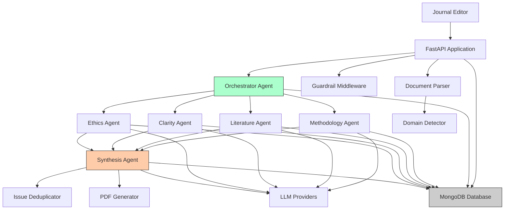
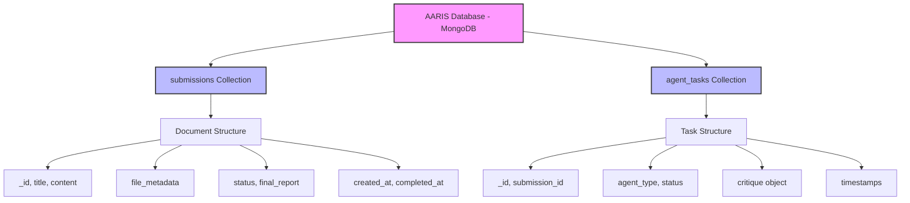
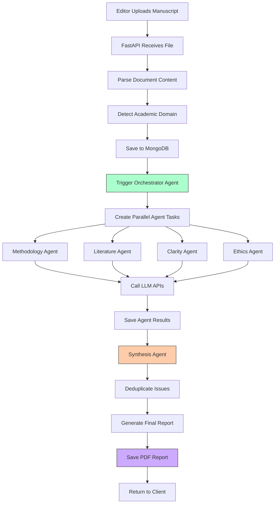
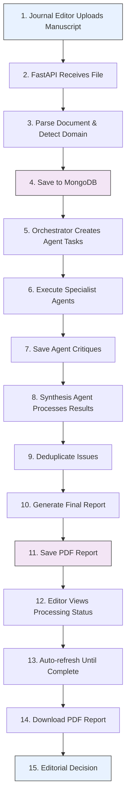

# Academic Agentic Review Intelligence System (AARIS)

[](https://python.org)
[](https://fastapi.tiangolo.com)
[](https://mongodb.com)
[](LICENSE)

An advanced AI-powered system for comprehensive academic manuscript review using multi-agent architecture. AARIS combines specialized AI agents to provide structured, domain-aware analysis of academic papers across 21+ disciplines.

## ⚠️ Important Disclaimer

**HUMAN OVERSIGHT REQUIRED**: This system provides preliminary AI-generated reviews only. Human expert validation is mandatory before any editorial decisions. Do not use for final publication decisions without qualified human reviewer approval.

## 🚀 Key Features

### LangGraph Workflow Architecture

- **Orchestrator**: Coordinates LangGraph workflow execution
- **LangGraph Workflow**: Parallel processing of all specialist analyses
- **LangChain Service**: Multi-LLM support with RAG capabilities
- **Domain Detection**: Automatically identifies academic discipline (21+ domains)

### Advanced Capabilities

- **Parallel Processing**: All specialist agents run concurrently via LangGraph
- **RAG Integration**: Semantic search and context retrieval with LangChain
- **Multi-Model Consensus**: Critical decisions use multiple AI models
- **Domain-Aware Reviews**: Tailored criteria for each academic field
- **Issue Deduplication**: Eliminates redundant findings across analyses
- **Guardrails System**: Ensures ethical and professional output
- **PDF Generation**: Professional, formatted review reports
- **File Downloads**: Role-based access to original manuscripts and review PDFs
- **Multi-LLM Support**: OpenAI, Anthropic, Google Gemini, Groq
- **Super Admin Dashboard**: Comprehensive system management and monitoring
  - User management with role-based access control
  - Real-time submission monitoring and reprocessing
  - Security audit logging and IP tracking
  - Performance metrics and analytics
  - API key management
- **Dual Authentication**: JWT tokens and API keys for flexible access
- **Passkey Authentication**: Biometric login with fingerprint/Face ID support

### Supported Academic Domains

- Medical & Biomedical Sciences
- Computer Science & Engineering
- Psychology & Social Sciences
- Biology & Bioinformatics
- Physics & Chemistry
- Mathematics & Statistics
- Economics & Business
- Law & Political Science
- Philosophy & Linguistics
- Environmental Science & Education
- Anthropology

## 🏗️ System Architecture

### High-Level Architecture



### Data Flow Architecture



### Process Flow Diagram



### User Flow Diagram



## 📋 Prerequisites

- Python 3.11+
- MongoDB (local or Atlas)
- LLM API keys (at least one):
  - OpenAI API key
  - Anthropic API key
  - Google Gemini API key
  - Groq API key

## 🛠️ Installation

### 1. Clone Repository

```bash
git clone https://github.com/your-repo/academic-journal-reviewer.git
cd academic-journal-reviewer
```

### 2. Create Virtual Environment

```bash
python -m venv .venv
source .venv/bin/activate  # On Windows: .venv\Scripts\activate
```

### 3. Install Dependencies

```bash
pip install -r requirements.txt
```

### 4. Environment Configuration

Create `.env` file:

```env
# MongoDB Configuration
MONGODB_URL=mongodb://localhost:27017
MONGODB_DATABASE=aaris

# LLM API Keys (configure at least one)
DEFAULT_LLM=openai
OPENAI_API_KEY=your_openai_api_key_here
ANTHROPIC_API_KEY=your_anthropic_api_key_here
GEMINI_API_KEY=your_gemini_api_key_here
GROQ_API_KEY=your_groq_api_key_here

# Application
APP_ID=aaris-app
```

### 5. Start MongoDB

```bash
# Local MongoDB
mongod

# Or use MongoDB Atlas (cloud)
# Update MONGODB_URL in .env with your Atlas connection string
```

### 6. Run Application

```bash
uvicorn app.main:app --reload --host 0.0.0.0 --port 8000
```

## 📚 API Documentation

### Base URL

```plain-text
http://localhost:8000
```

### Interactive API Docs

- **Swagger UI**: [http://localhost:8000/docs](http://localhost:8000/docs)
- **ReDoc**: [http://localhost:8000/redoc](http://localhost:8000/redoc)

### Key Endpoints

#### Upload Manuscript

```http
POST /api/v1/submissions/upload
Content-Type: multipart/form-data

file: manuscript.pdf (or .docx)
```

Initiates LangGraph workflow with parallel agent processing


#### Get Final Report

```http
GET /api/v1/submissions/{submission_id}/report
```

#### Download PDF Report

```http
GET /api/v1/submissions/{submission_id}/download
```

#### Download Original Manuscript

```http
GET /api/v1/downloads/manuscripts/{submission_id}
Authorization: Bearer <token>
```

Download the original uploaded manuscript with role-based permissions

#### Download Review PDF

```http
GET /api/v1/downloads/reviews/{submission_id}
Authorization: Bearer <token>
```

Download the processed review report with role-based permissions

#### System Disclaimer

```http
GET /disclaimer
```

#### LangGraph System Status

```http
GET /api/v1/system/langgraph-status
```

Check LangGraph and LangChain integration status

## 🔧 Configuration

### LLM Provider Selection

Set `DEFAULT_LLM` in `.env`:

- `openai` - OpenAI GPT models
- `anthropic` - Claude models
- `gemini` - Google Gemini
- `groq` - Groq models

### Domain-Specific Weights

The system automatically adjusts review criteria based on detected domain:

- **Medical**: Methodology (40%), Ethics (30%)
- **Computer Science**: Methodology (40%), Clarity (30%)
- **Mathematics**: Methodology (50%), Clarity (30%)
- **Law**: Literature (40%), Clarity (25%)

## 📊 Review Process Flow

1. **Document Upload**: PDF/DOCX parsing and content extraction
2. **Domain Detection**: Automatic identification of academic field
3. **Background Processing**: All analysis runs automatically without user intervention
4. **Methodology Analysis**: Research design, statistical methods
5. **Literature Review**: Citation analysis, theoretical framework
6. **Clarity Assessment**: Writing quality, presentation
7. **Ethics Evaluation**: Research ethics, bias detection
8. **Issue Deduplication**: Remove redundant findings
9. **Synthesis**: Compile comprehensive final report
10. **Auto-Display**: Report appears when processing completes

## 🛡️ Guardrails & Safety

### Content Filtering

- Sensitive data detection (PII, patient info)
- Ethical content screening
- Professional tone enforcement
- Bias detection and mitigation

### Quality Assurance

- Multi-agent validation
- Issue prioritization (Critical/Important/Minor)
- Domain-specific criteria application
- Standardized paragraph limits

## 📁 Project Structure

```plain-text
academic_journal_reviewer/
├── app/
│   ├── agents/                 # AI agents
│   │   ├── base_agent.py
│   │   ├── orchestrator.py
│   │   ├── specialist_agents.py
│   │   └── synthesis_agent.py
│   ├── api/                    # API routes
│   │   ├── routes.py
│   │   └── download_routes.py
│   ├── core/                   # Configuration
│   │   └── config.py
│   ├── middleware/             # Guardrails
│   │   └── guardrail_middleware.py
│   ├── models/                 # Data models
│   │   ├── schemas.py
│   │   └── responses.py
│   ├── services/               # Core services
│   │   ├── domain_detector.py
│   │   ├── guardrails.py
│   │   ├── issue_deduplicator.py
│   │   ├── llm_service.py
│   │   ├── mongodb_service.py
│   │   ├── pdf_generator.py
│   │   └── disclaimer_service.py
│   └── main.py                 # Application entry
├── requirements.txt
├── .env.example
└── README.md
```

## 🧪 Testing

### Run Tests

```bash
pytest tests/
```

### Test Coverage

```bash
pytest --cov=app tests/
```

## 🚀 Deployment

### Development

```bash
docker-compose up -d
```

### Production

```bash
# Quick deploy
./deploy.sh

# Or manual
docker-compose -f docker-compose.prod.yml up -d
```

See [DEPLOYMENT.md](./docs/DEPLOYMENT.md) for detailed production setup.

### Production Features

- Multi-worker Uvicorn
- MongoDB authentication
- Nginx reverse proxy
- Health checks
- Security hardening

## 🤝 Contributing

1. Fork the repository
2. Create feature branch (`git checkout -b feature/amazing-feature`)
3. Commit changes (`git commit -m 'Add amazing feature'`)
4. Push to branch (`git push origin feature/amazing-feature`)
5. Open Pull Request

## 📄 License

This project is licensed under the Apache License 2.0 - see the [LICENSE](LICENSE) file for details.

## ⚠️ Ethical Use Guidelines

### Intended Use

- Preliminary manuscript screening
- Structured review assistance
- Consistency in review criteria
- Educational and research purposes

### Prohibited Use

- Autonomous publication decisions
- Replacement of human peer review
- Final acceptance/rejection without human oversight
- Commercial use without proper licensing

### Best Practices

- Always involve human experts in final decisions
- Use as one input among many in review process
- Regularly validate AI recommendations
- Maintain transparency about AI assistance

## 🛡️ Dashboards

AARIS includes **five dashboards** for different user roles:

### Author Dashboard (Personal Tracking)

**Access**: `http://localhost:3000/author-dashboard`  
**Required Role**: Any authenticated user

**Key Features**:
- **Personal Statistics**: Track your own submission metrics
- **My Submissions**: View and manage your manuscripts
- **Analytics**: Timeline and domain distribution for your work
- **Performance Metrics**: Average review processing times
- **Download Reports**: Access completed review PDFs
- **Delete Submissions**: Remove your own submissions

**Three Main Tabs**:
1. **Overview**: Quick stats, performance metrics, recent submissions
2. **My Submissions**: Complete list with status filters and actions
3. **Analytics**: 30-day timeline and domain distribution

**Documentation**:
- [Author Dashboard Guide](./docs/AUTHOR_DASHBOARD.md)
- [Author Dashboard Quick Start](./docs/AUTHOR_DASHBOARD_QUICK_START.md)

---

### Editor Dashboard (Editorial Management)

**Access**: `http://localhost:3000/editor-dashboard`  
**Required Role**: `editor`, `admin`, or `super_admin`

**Key Features**:
- **View All Submissions**: Access manuscripts from all authors
- **Editorial Decisions**: Accept, revise, or reject manuscripts
- **Workflow Management**: Reprocess failed submissions
- **Performance Metrics**: Review processing analytics
- **Domain Analytics**: Submission distribution by field
- **Recent Activity**: Monitor latest submission updates

**Three Main Tabs**:
1. **Overview**: System statistics, performance metrics, recent submissions
2. **All Submissions**: Complete submission list with filtering and actions
3. **Analytics**: 30-day trends, domain distribution, status breakdown

**Editorial Actions**:
- Make formal decisions (Accept/Revise/Reject)
- Add editorial comments
- Reprocess failed reviews
- Download review reports
- Track decision history

**Documentation**:
- [Editor Dashboard Guide](./docs/EDITOR_DASHBOARD.md)
- [Editor Dashboard Quick Start](./docs/EDITOR_DASHBOARD_QUICK_START.md)

---

### Reviewer Dashboard (Peer Review Management)

**Access**: `http://localhost:3000/reviewer-dashboard`  
**Required Role**: `reviewer`, `editor`, `admin`, or `super_admin`

**Key Features**:
- **View Assigned Manuscripts**: Access manuscripts assigned for review
- **Conduct Reviews**: Comprehensive review form with scoring system
- **Track Review Status**: Monitor pending, in-progress, and completed reviews
- **Performance Analytics**: Review timeline and domain distribution
- **Review Workflow**: Start, continue, and submit reviews
- **Quality Metrics**: Average review time and completion statistics

**Three Main Tabs**:
1. **Overview**: Statistics, recent assignments, performance metrics
2. **My Assignments**: Complete list with status filters and actions
3. **Analytics**: 30-day timeline, domain distribution, performance data

**Review Features**:
- Score manuscripts on multiple criteria (1-10 scale)
- Provide strengths and weaknesses
- Write detailed comments
- Make recommendations (Accept/Revise/Major Revise/Reject)
- Track review time automatically

**Documentation**:
- [Reviewer Dashboard Guide](./docs/REVIEWER_DASHBOARD.md)
- [Reviewer Dashboard Quick Start](./docs/REVIEWER_DASHBOARD_QUICK_START.md)

---

AARIS also includes **two administrative dashboards** for different management roles:

### 1. Admin Dashboard (Operational Management)

**Access**: `http://localhost:3000/admin-dashboard`  
**Required Role**: `admin` or `super_admin`

**Key Features**:
- View and manage users (limited)
- Monitor submissions (read-only)
- View audit logs (30 days)
- Create API keys (limited roles)
- View analytics and statistics

**Limitations**:
- Cannot view/modify super_admin accounts
- Cannot create or delete users
- Cannot change user roles
- Cannot reprocess or delete submissions
- Cannot perform system operations

**Documentation**:
- [Admin vs Super Admin Comparison](./docs/ADMIN_VS_SUPER_ADMIN.md)
- [Admin Dashboard Quick Start](./docs/ADMIN_DASHBOARD_QUICK_START.md)

### 2. Super Admin Dashboard (Full System Control)

**Access**: `http://localhost:3000/super-admin`  
**Required Role**: `super_admin`

**Key Features**:
- **User Management**: Create, edit, delete users with role assignment
- **Submission Control**: Monitor, reprocess, and delete manuscript reviews
- **Security Monitoring**: Audit logs (90 days), IP tracking, security statistics
- **Analytics**: Submission trends, domain distribution, performance metrics
- **API Key Management**: Create, view, and revoke all API keys
- **System Operations**: Cache management, health monitoring, maintenance

**Full Capabilities**:
- Complete user lifecycle management
- Full submission control
- Extended audit log access
- Performance monitoring
- System maintenance tools

**Documentation**:
- [Super Admin Dashboard README](./docs/ADMIN_DASHBOARD_README.md)
- [Super Admin Dashboard Guide](./docs/ADMIN_DASHBOARD_GUIDE.md)
- [Super Admin Quick Reference](./docs/ADMIN_QUICK_REFERENCE.md)
- [Implementation Details](./docs/ADMIN_DASHBOARD_IMPLEMENTATION.md)

### Dashboard Comparison

| Feature | Author | Reviewer | Editor | Admin | Super Admin |
|---------|--------|----------|--------|-------|-------------|
| **URL** | `/author-dashboard` | `/reviewer-dashboard` | `/editor-dashboard` | `/admin-dashboard` | `/super-admin` |
| **Access** | All users | Reviewer+ | Editor+ | Admin+ | Super Admin only |
| **Tabs** | 3 | 3 | 3 | 8 | 9 |
| **Own Submissions** | Full control | View all | View all | View all | View all |
| **All Submissions** | No | No | Yes | Yes | Yes |
| **Assigned Reviews** | No | Yes | Yes | No | Yes |
| **Conduct Reviews** | No | Yes | Yes | No | Yes |
| **Editorial Decisions** | No | No | Yes | No | Yes |
| **Reprocess Submissions** | No | No | Yes | No | Yes |
| **User Management** | None | None | None | View & activate | Full control |
| **Audit Logs** | None | None | None | 30 days | 90 days |
| **API Keys** | None | None | None | Create (limited) | Full management |
| **System Operations** | None | None | None | None | Full access |
| **Performance Metrics** | Own only | Review metrics | All | None | Full access |

### Choosing the Right Dashboard

**Use Author Dashboard for**:
- Tracking your own submissions
- Downloading review reports
- Analyzing your submission patterns
- Managing your manuscripts

**Use Reviewer Dashboard for**:
- Viewing assigned manuscripts
- Conducting peer reviews
- Tracking review progress
- Analyzing review performance
- Managing review workload

**Use Editor Dashboard for**:
- Managing all manuscript submissions
- Making editorial decisions
- Monitoring review workflow
- Reprocessing failed reviews
- Analyzing submission trends

**Use Admin Dashboard for**:
- Day-to-day operations
- User monitoring
- Submission tracking
- Routine API key creation

**Use Super Admin Dashboard for**:
- System administration
- Critical operations
- Performance monitoring
- Security management
- Data management

## 📞 Support

- **Documentation**: Check API docs at `/docs`
- **Dashboards**: 
  - [Author Dashboard Guide](./docs/AUTHOR_DASHBOARD.md)
  - [Author Quick Start](./docs/AUTHOR_DASHBOARD_QUICK_START.md)
  - [Reviewer Dashboard Guide](./docs/REVIEWER_DASHBOARD.md)
  - [Reviewer Quick Start](./docs/REVIEWER_DASHBOARD_QUICK_START.md)
  - [Editor Dashboard Guide](./docs/EDITOR_DASHBOARD.md)
  - [Editor Quick Start](./docs/EDITOR_DASHBOARD_QUICK_START.md)
  - [Admin vs Super Admin](./docs/ADMIN_VS_SUPER_ADMIN.md)
  - [Admin Quick Start](./docs/ADMIN_DASHBOARD_QUICK_START.md)
  - [Super Admin README](./docs/ADMIN_DASHBOARD_README.md)
- **Issues**: Report bugs via GitHub Issues
- **Discussions**: Use GitHub Discussions for questions

## 🙏 Acknowledgments

- Built with FastAPI, MongoDB, and ReportLab
- Powered by multiple LLM providers
- Inspired by the need for fair and efficient academic review

---

**Remember**: This system is designed to assist, not replace, human expertise in academic review. Always ensure human oversight for fair and accurate manuscript evaluation.
