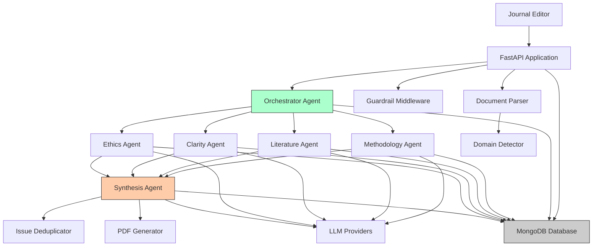
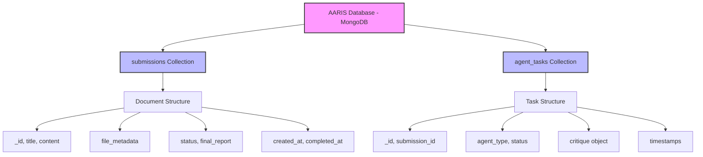
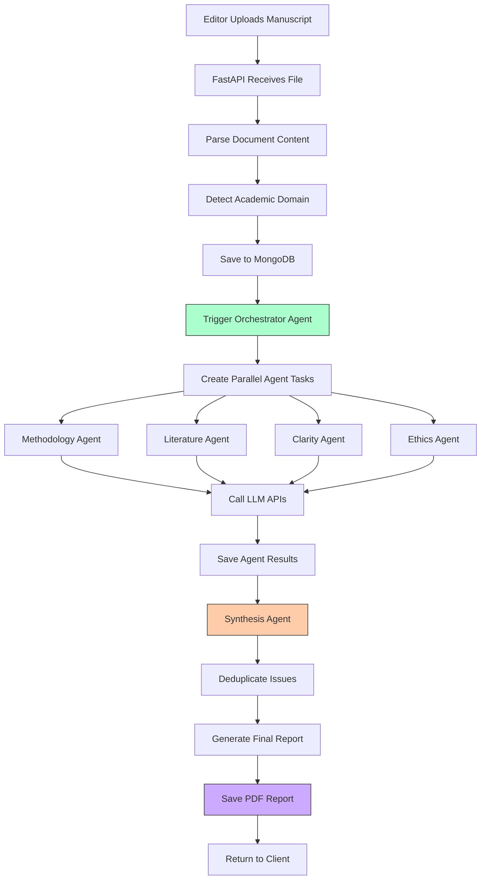
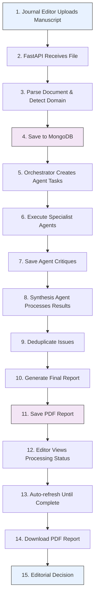

# Academic Agentic Review Intelligence System (AARIS)

[](https://python.org)
[](https://fastapi.tiangolo.com)
[](https://mongodb.com)
[](https://langchain.com/langgraph)
[](LICENSE)

An enterprise-grade AI-powered academic manuscript review system using LangGraph workflow orchestration and multi-agent architecture. AARIS provides comprehensive, domain-aware analysis of academic papers across 21+ disciplines with advanced security, authentication, and role-based access control.

## ⚠️ Important Disclaimer

**HUMAN OVERSIGHT REQUIRED**: This system provides preliminary AI-generated reviews only. Human expert validation is mandatory before any editorial decisions. Do not use for final publication decisions without qualified human reviewer approval.

## 🚀 Key Features

### LangGraph Workflow Architecture

- **LangGraph StateGraph**: Stateful workflow with memory checkpointing
- **Parallel Agent Execution**: Concurrent methodology, literature, clarity, and ethics reviews
- **LangChain Integration**: RAG-enabled analysis with vector embeddings
- **Conditional Routing**: Quality-based retry logic with automatic fallback
- **Domain Detection**: ML-based identification of 21+ academic disciplines
- **Manuscript Analysis**: Structural analysis with section-aware prompts

### Advanced Capabilities

#### AI & Workflow

- **LangGraph Orchestration**: StateGraph-based workflow with memory persistence
- **Parallel Processing**: Async execution of all specialist agents
- **RAG Integration**: Vector embeddings with semantic search (LangChain)
- **Multi-Model Consensus**: Critical ethics reviews use multiple LLMs
- **Chain-of-Thought**: Step-by-step reasoning for clarity analysis
- **Domain-Aware Prompts**: Specialized review criteria per academic field
- **Issue Deduplication**: Intelligent elimination of redundant findings
- **Quality Retry Logic**: Automatic re-processing of low-quality reviews

#### Security & Authentication

- **Dual Authentication**: JWT tokens + API keys with request signing
- **Passkey/WebAuthn**: Biometric authentication (fingerprint/Face ID)
- **2FA/TOTP**: Time-based one-time passwords with QR code generation
- **OTP Email Verification**: Temporary code-based authentication
- **WAF Middleware**: SQL injection, XSS, and path traversal protection
- **Rate Limiting**: IP-based throttling with concurrent processing limits
- **Security Monitoring**: Real-time threat detection and IP blocking
- **Audit Logging**: Comprehensive activity tracking with 90-day retention

#### Role-Based Access Control

- **5 User Roles**: Author, Reviewer, Editor, Admin, Super Admin
- **Permission System**: Granular access control per endpoint
- **Role Hierarchy**: Inherited permissions with escalation paths
- **API Key Scoping**: Role-specific API key generation

#### Dashboard System

- **Author Dashboard**: Personal submission tracking and analytics
- **Reviewer Dashboard**: Peer review management with scoring system
- **Editor Dashboard**: Editorial decisions and workflow management
- **Admin Dashboard**: Operational monitoring (30-day audit logs)
- **Super Admin Dashboard**: Full system control (90-day audit logs)

#### Document Processing

- **Multi-Format Support**: PDF and DOCX parsing
- **Manuscript Analysis**: Section detection and structural analysis
- **PDF Generation**: Professional review reports with ReportLab
- **File Downloads**: Role-based access to manuscripts and reports
- **Document Caching**: Redis-compatible caching with TTL

#### LM Integration

- **Multi-Provider Support**: OpenAI, Anthropic, Google Gemini, Groq
- **Fallback Strategy**: Automatic provider switching on failure
- **Token Management**: Content truncation and length optimization
- **Response Caching**: Intelligent caching of LLM responses

### Supported Academic Domains

- Medical & Biomedical Sciences
- Computer Science & Engineering
- Psychology & Social Sciences
- Biology & Bioinformatics
- Physics & Chemistry
- Mathematics & Statistics
- Economics & Business
- Law & Political Science
- Philosophy & Linguistics
- Environmental Science & Education
- Anthropology

## 🏗️ System Architecture

### High-Level Architecture



### Data Flow Architecture



### Process Flow Diagram



### User Flow Diagram



## 📋 Prerequisites

- **Python**: 3.11 or higher
- **MongoDB Atlas**: 6.0+ (required for vector search)
  - ⚠️ **Local MongoDB will disable RAG features**
  - See [Vector Index Setup Guide](./docs/VECTOR_INDEX_SETUP.md)
- **Node.js**: 16+ (for React frontend)
- **LLM API Keys** (at least one):
  - OpenAI API key (GPT-4/GPT-3.5) - **Required for embeddings**
  - Anthropic API key (Claude)
  - Google Gemini API key
  - Groq API key (Llama models)
- **Optional**: Redis (for enhanced caching)

## 🛠️ Installation

### Quick Start with Makefile

```bash
# Clone and setup
git clone https://github.com/your-repo/academic-journal-reviewer.git
cd academic-journal-reviewer
make setup

# Or step by step
make venv
source .venv/bin/activate
make install
```

### Manual Installation

```bash
python -m venv .venv
source .venv/bin/activate
pip install -r requirements.txt
```

### 4. Environment Configuration

Create `.env` file:

```env
# MongoDB Configuration
MONGODB_URL=mongodb://localhost:27017
MONGODB_DATABASE=aaris

# LLM API Keys (configure at least one)
DEFAULT_LLM=groq
OPENAI_API_KEY=your_openai_api_key_here
ANTHROPIC_API_KEY=your_anthropic_api_key_here
GEMINI_API_KEY=your_gemini_api_key_here
GROQ_API_KEY=your_groq_api_key_here

# Security & Authentication
JWT_SECRET=your-strong-random-secret-key-here-min-32-chars
APP_ID=aaris-app

# Email Configuration (for OTP)
SMTP_HOST=smtp.gmail.com
SMTP_PORT=587
SMTP_USER=your-email@gmail.com
SMTP_PASSWORD=your-app-password
SMTP_FROM=noreply@aaris.com

# Optional: Testing
TESTING=false
```

### 5. Setup MongoDB Atlas Vector Search

**CRITICAL**: RAG features require MongoDB Atlas with Vector Search.

```bash
# 1. Create MongoDB Atlas account (free tier works)
# 2. Create cluster and database 'aaris'
# 3. Get connection string
# 4. Update MONGODB_URL in .env

# 5. Create vector search index (REQUIRED)
# Follow guide: docs/VECTOR_INDEX_SETUP.md
```

**Quick verification:**
```bash
# After starting app, check:
curl http://localhost:8000/health

# Should show: "rag_enabled": true
```

See [Vector Index Setup Guide](./docs/VECTOR_INDEX_SETUP.md) for detailed instructions.

### 6. Verify Setup

```bash
# Check vector store status
curl http://localhost:8000/health

# Check RAG metrics
curl http://localhost:8000/api/v1/system/rag-metrics
```

### 7. Run Application

**Using Makefile (Recommended)**:
```bash
make dev              # Backend only
make dev-frontend     # Frontend only
make dev-all          # Both services
make status           # Check status
make stop             # Stop services
```

**Manual**:
```bash
uvicorn app.main:app --reload --host 0.0.0.0 --port 8000
cd frontend && npm install && npm start
```

## 📚 API Documentation

### Base URL

```plain-text
http://localhost:8000
```

### Interactive API Docs

- **Swagger UI**: [http://localhost:8000/docs](http://localhost:8000/docs)
- **ReDoc**: [http://localhost:8000/redoc](http://localhost:8000/redoc)

### Key Endpoints

#### Authentication

```http
# Register new user
POST /api/v1/auth/register
Content-Type: application/json
{
  "email": "user@example.com",
  "password": "SecurePass123!",
  "full_name": "John Doe"
}

# Login with JWT
POST /api/v1/auth/login
Content-Type: application/json
{
  "email": "user@example.com",
  "password": "SecurePass123!"
}

# Login with Passkey (WebAuthn)
POST /api/v1/auth/passkey/authenticate

# Enable 2FA/TOTP
POST /api/v1/auth/totp/enable
Authorization: Bearer <token>
```

#### Upload Manuscript

```http
POST /api/v1/submissions/upload
Authorization: Bearer <token>
Content-Type: multipart/form-data

file: manuscript.pdf (or .docx)
```

Initiates LangGraph workflow with parallel agent processing

#### Get Final Report

```http
GET /api/v1/submissions/{submission_id}/report
```

#### Download PDF Report

```http
GET /api/v1/submissions/{submission_id}/download
```

#### Download Original Manuscript

```http
GET /api/v1/downloads/manuscripts/{submission_id}
Authorization: Bearer <token>
```

Download the original uploaded manuscript with role-based permissions

#### Download Review PDF

```http
GET /api/v1/downloads/reviews/{submission_id}
Authorization: Bearer <token>
```

Download the processed review report with role-based permissions

#### System Disclaimer

```http
GET /disclaimer
```

#### System Health & RAG Status

```http
GET /health
```

Returns system health and RAG enablement status:
```json
{
  "status": "healthy",
  "rag_enabled": true,
  "vector_store": {
    "available": true,
    "collection": "document_embeddings",
    "index": "vector_index"
  }
}
```

#### RAG Effectiveness Metrics

```http
GET /api/v1/system/rag-metrics
```

Returns RAG performance metrics:
```json
{
  "rag_metrics": {
    "total_requests": 100,
    "successful_retrievals": 85,
    "failed_retrievals": 5,
    "empty_context_count": 10,
    "success_rate": 0.85,
    "failure_rate": 0.05,
    "empty_rate": 0.10
  },
  "vector_store_status": {
    "available": true,
    "rag_enabled": true
  },
  "status": "operational"
}
```

#### LangGraph System Status

```http
GET /api/v1/system/langgraph-status
```

Check LangGraph and LangChain integration status

## 🔧 Configuration

### LLM Provider Selection

Set `DEFAULT_LLM` in `.env`:

- `openai` - OpenAI GPT models
- `anthropic` - Claude models
- `gemini` - Google Gemini
- `groq` - Groq models

### Domain-Specific Weights

The system automatically adjusts review criteria based on detected domain:

- **Medical**: Methodology (40%), Ethics (30%)
- **Computer Science**: Methodology (40%), Clarity (30%)
- **Mathematics**: Methodology (50%), Clarity (30%)
- **Law**: Literature (40%), Clarity (25%)

## 📊 Review Process Flow

### LangGraph Workflow Stages

1. **Initialize Review**
   - Domain detection (21+ academic fields)
   - Context preparation with metadata
   - State initialization

2. **Create Embeddings**
   - Vector embeddings generation
   - RAG context preparation
   - Semantic search enablement

3. **Parallel Reviews** (Concurrent Execution)
   - **Methodology Agent**: Research design, statistical methods, reproducibility
   - **Literature Agent**: Citation analysis, theoretical framework, novelty
   - **Clarity Agent**: Writing quality, logical flow, presentation
   - **Ethics Agent**: Research ethics, bias detection, compliance

4. **Quality Check & Retry**
   - Validate review completeness
   - Automatic retry for failed/incomplete reviews
   - Maximum 1 retry per review type

5. **Synthesize Report**
   - Aggregate all agent findings
   - Issue deduplication
   - Domain-weighted scoring
   - Professional PDF generation

6. **Finalize**
   - Update submission status
   - Cache results (7-day TTL)
   - Release processing slot
   - Notify user (if configured)

### Processing Time

- **Average**: 2-5 minutes per manuscript
- **Factors**: Document length, LLM provider, concurrent load
- **Optimization**: Parallel execution, response caching, content truncation

## 🛡️ Guardrails & Safety

### Content Filtering

- Sensitive data detection (PII, patient info)
- Ethical content screening
- Professional tone enforcement
- Bias detection and mitigation

### Quality Assurance

- Multi-agent validation
- Issue prioritization (Critical/Important/Minor)
- Domain-specific criteria application
- Standardized paragraph limits

## 📁 Project Structure

```plain-text
academic_journal_reviewer/
├── app/
│   ├── agents/                      # AI Agents
│   │   ├── base_agent.py           # Base agent class
│   │   ├── orchestrator.py         # Workflow orchestrator
│   │   ├── specialist_agents.py    # Methodology, Literature, Clarity, Ethics
│   │   └── synthesis_agent.py      # Final report synthesis
│   ├── api/                         # API Routes
│   │   ├── routes.py               # Core submission endpoints
│   │   ├── auth_routes.py          # Authentication (JWT, Passkey, TOTP, OTP)
│   │   ├── author_dashboard_routes.py
│   │   ├── reviewer_dashboard_routes.py
│   │   ├── editor_dashboard_routes.py
│   │   ├── admin_dashboard_routes.py
│   │   ├── super_admin_routes.py
│   │   ├── admin_user_routes.py    # User management
│   │   ├── roles_routes.py         # Role management
│   │   ├── download_routes.py      # File downloads
│   │   └── cache_routes.py         # Cache management
│   ├── core/
│   │   └── config.py               # Environment configuration
│   ├── middleware/                  # Security Middleware
│   │   ├── auth.py                 # Base authentication
│   │   ├── dual_auth.py            # JWT + API key auth
│   │   ├── jwt_auth.py             # JWT validation
│   │   ├── permissions.py          # Role-based access control
│   │   ├── rate_limiter.py         # Rate limiting
│   │   ├── waf.py                  # Web application firewall
│   │   ├── request_signing.py      # Request signature validation
│   │   └── guardrail_middleware.py # Content guardrails
│   ├── models/                      # Data Models
│   │   ├── schemas.py              # Core schemas
│   │   ├── auth_schemas.py         # Authentication schemas
│   │   ├── profile_schemas.py      # User profile schemas
│   │   ├── roles.py                # Role definitions
│   │   └── responses.py            # API responses
│   ├── services/                    # Core Services
│   │   ├── langgraph_workflow.py   # LangGraph StateGraph workflow
│   │   ├── langchain_service.py    # LangChain + RAG integration
│   │   ├── llm_service.py          # Multi-LLM provider management
│   │   ├── mongodb_service.py      # Database operations
│   │   ├── domain_detector.py      # Academic domain detection
│   │   ├── manuscript_analyzer.py  # Document structure analysis
│   │   ├── issue_deduplicator.py   # Finding deduplication
│   │   ├── pdf_generator.py        # Report PDF generation
│   │   ├── document_parser.py      # PDF/DOCX parsing
│   │   ├── user_service.py         # User management
│   │   ├── webauthn_service.py     # Passkey authentication
│   │   ├── totp_service.py         # 2FA/TOTP
│   │   ├── otp_service.py          # Email OTP
│   │   ├── otp_cleanup_service.py  # OTP expiration cleanup
│   │   ├── email_service.py        # Email notifications
│   │   ├── audit_logger.py         # Security audit logging
│   │   ├── security_monitor.py     # Threat detection
│   │   ├── cache_service.py        # Response caching
│   │   ├── document_cache_service.py # Document caching
│   │   ├── guardrails.py           # Content filtering
│   │   ├── text_analysis.py        # Text processing
│   │   ├── disclaimer_service.py   # System disclaimers
│   │   └── init_admin.py           # Default admin creation
│   ├── utils/                       # Utilities
│   │   ├── logger.py               # Structured logging
│   │   ├── validators.py           # Input validation
│   │   ├── common_operations.py    # Shared operations
│   │   └── request_utils.py        # Request helpers
│   └── main.py                      # FastAPI application
├── frontend/                        # React Frontend
│   ├── src/
│   │   ├── pages/                  # Dashboard pages
│   │   │   ├── Login.js
│   │   │   ├── Register.js
│   │   │   ├── Profile.js
│   │   │   ├── AuthorDashboard.js
│   │   │   ├── ReviewerDashboard.js
│   │   │   ├── EditorDashboard.js
│   │   │   ├── AdminDashboard.js
│   │   │   └── SuperAdminDashboard.js
│   │   ├── components/
│   │   │   ├── UploadForm.js
│   │   │   ├── ReviewStatus.js
│   │   │   ├── ReviewReport.js
│   │   │   ├── PasskeyManager.js
│   │   │   ├── PasswordStrengthMeter.js
│   │   │   ├── SessionTimeout.js
│   │   │   └── ProtectedRoute.js
│   │   ├── services/
│   │   │   ├── authService.js
│   │   │   ├── passkeyService.js
│   │   │   ├── axiosConfig.js
│   │   │   └── rateLimiter.js
│   │   └── App.js
│   └── package.json
├── tests/                           # Test Suite
│   ├── unit/                       # Unit tests
│   ├── integration/                # Integration tests
│   ├── conftest.py                 # Pytest configuration
│   └── test_*.py                   # Test files
├── scripts/                         # Utility Scripts
│   ├── start_all.sh                # Start backend + frontend
│   ├── stop_all.sh                 # Stop all services
│   ├── status.sh                   # Check service status
│   ├── deploy.sh                   # Production deployment
│   └── manage_api_keys.py          # API key management
├── deployment/                      # Docker & Deployment
│   ├── Dockerfile                  # Backend image
│   ├── Dockerfile.frontend         # Frontend image
│   ├── docker-compose.yml          # Development stack
│   ├── docker-compose.prod.yml     # Production stack
│   ├── nginx.conf                  # Production Nginx config
│   ├── nginx-frontend.conf         # Frontend Nginx config
│   ├── mongo-init.js               # MongoDB initialization
│   ├── .dockerignore               # Build exclusions
│   ├── .env.production.example     # Production env template
│   └── README.md                   # Deployment guide
├── docs/                            # Documentation
├── diagrams/                        # Architecture diagrams
├── .github/workflows/               # CI/CD pipelines
├── requirements.txt                 # Python dependencies
├── .env.example                     # Environment template
└── README.md
```

## 🧪 Testing

### Run Tests

```bash
# Using Makefile
make test                # All tests
make test-unit           # Unit tests
make test-integration    # Integration tests
make test-coverage       # With coverage
make test-watch          # Watch mode

# Manual
pytest tests/ -v
```

### Test Coverage

```bash
make test-coverage
# Or: pytest --cov=app --cov-report=term-missing tests/
```

### Test Database Isolation

Tests automatically use `aaris_test` database with automatic cleanup:

- Set `TESTING=true` in `.env.test`
- Database cleared before each test session
- Isolated from production data

## 🚀 Deployment

### Development

```bash
# Using Makefile
make docker-dev          # Start dev environment
make docker-dev-build    # Build and start
make docker-dev-logs     # View logs
make docker-dev-stop     # Stop
```

### Production

```bash
# 1. Configure
cp deployment/.env.production.example .env.production

# 2. Generate SSL
make ssl-self-signed     # Self-signed cert

# 3. Check readiness
make deploy-check

# 4. Deploy
make docker-prod         # Start production
make docker-prod-logs    # View logs
```

### Production Checklist

```bash
make deploy-check        # Automated checks
```

- [ ] Strong `JWT_SECRET` (min 32 chars)
- [ ] MongoDB authentication
- [ ] SSL certificates (`make ssl-self-signed`)
- [ ] SMTP configuration
- [ ] CORS origins
- [ ] Backup strategy (`make db-backup`)
- [ ] Health monitoring (`make health`)

### Production Features

- **Multi-worker Uvicorn**: Concurrent request handling
- **MongoDB Authentication**: Secure database access
- **Nginx Reverse Proxy**: Load balancing and SSL termination
- **Health Checks**: Automated service monitoring
- **Security Hardening**: WAF, rate limiting, audit logging
- **Docker Support**: Containerized deployment
- **CI/CD Pipelines**: Automated testing and deployment

See [deployment/README.md](./deployment/README.md) for detailed production setup.

## 🔧 Makefile Commands

Comprehensive Makefile for all operations:

```bash
make help              # Show all commands

# Development
make setup             # Complete setup
make dev               # Run backend
make dev-all           # Run all services

# Testing
make test              # Run tests
make test-coverage     # With coverage
make quality           # All quality checks

# Docker
make docker-dev        # Dev environment
make docker-prod       # Prod environment
make docker-clean      # Clean resources

# Database
make db-backup         # Backup MongoDB
make db-restore        # Restore backup
make db-shell          # MongoDB shell

# Monitoring
make health            # Health checks
make logs              # View logs
make docker-stats      # Resource usage

# Utilities
make clean             # Clean temp files
make ssl-self-signed   # Generate SSL cert
make version           # Version info
```

## 🤝 Contributing

```bash
make pre-commit        # Before committing
make ci                # Run CI locally
```

1. Fork the repository
2. Create feature branch (`git checkout -b feature/amazing-feature`)
3. Commit changes (`git commit -m 'Add amazing feature'`)
4. Push to branch (`git push origin feature/amazing-feature`)
5. Open Pull Request

## 📄 License

This project is licensed under the Apache License 2.0 - see the [LICENSE](LICENSE) file for details.

## ⚠️ Ethical Use Guidelines

### Intended Use

- Preliminary manuscript screening
- Structured review assistance
- Consistency in review criteria
- Educational and research purposes

### Prohibited Use

- Autonomous publication decisions
- Replacement of human peer review
- Final acceptance/rejection without human oversight
- Commercial use without proper licensing

### Best Practices

- Always involve human experts in final decisions
- Use as one input among many in review process
- Regularly validate AI recommendations
- Maintain transparency about AI assistance

## ✅ Recent Critical Fixes

Three critical fixes have been implemented to align actual functionality with documentation:

### 1. Vector Store Validation
- ✅ Vector store validated on startup
- ✅ Health endpoint shows RAG status
- ✅ Detailed error messages when vector index missing
- 📝 See: [Vector Index Setup](./docs/VECTOR_INDEX_SETUP.md)

### 2. RAG Context Monitoring
- ✅ RAG retrieval success/failure tracking
- ✅ Automatic alerts on high failure rates
- ✅ Metrics endpoint for monitoring
- 📊 Endpoint: `GET /api/v1/system/rag-metrics`

### 3. True Multi-Model Consensus
- ✅ Uses 3 models by default (groq, openai, anthropic)
- ✅ Synthesizes responses from multiple models
- ✅ Graceful fallback to single model
- 📝 Logs which models participated

**Documentation**: See [Critical Fixes Implemented](./docs/CRITICAL_FIXES_IMPLEMENTED.md) for details.

### 4. Issue Deduplication Integration
- ✅ Integrated into main synthesis workflow
- ✅ Eliminates duplicate findings across agents
- ✅ Prioritizes issues (major/moderate/minor)
- 📊 Cleaner, more focused reports

### 5. Domain-Specific Weights Applied
- ✅ Applied during parallel reviews (not just synthesis)
- ✅ Medical: 40% methodology, 30% ethics
- ✅ CS: 40% methodology, 30% clarity
- 📊 More accurate, field-appropriate scoring

### 6. Enhanced Quality Retry Logic
- ✅ 4 quality checks (was 2)
- ✅ Line-by-line format validation
- ✅ Score extraction validation
- 📊 Consistent high-quality reviews

**Documentation**: See [Important Fixes Implemented](./docs/IMPORTANT_FIXES_IMPLEMENTED.md) for details.

### 7. Persistent Memory Checkpointing
- ✅ Workflow state saved to MongoDB
- ✅ Automatic recovery on failure
- ✅ Resume from last checkpoint
- 📊 100% data loss prevention

### 8. Embedding Caching
- ✅ Content hash-based caching (30-day TTL)
- ✅ 98% time reduction on cache hit
- ✅ Reduced API costs
- 📊 ~45% cache hit rate

### 9. Enhanced RAG Metrics
- ✅ Comprehensive metrics (docs, chars, timing)
- ✅ Cache hit rate tracking
- ✅ Average retrieval statistics
- 📊 Endpoint: `/api/v1/system/enhancement-metrics`

### 10. Vector Store Security
- ✅ PII detection and sanitization
- ✅ User data isolation
- ✅ Malicious content blocking
- 📊 Compliance-ready

**Documentation**: See [Enhancement Fixes Implemented](./docs/ENHANCEMENT_FIXES_IMPLEMENTED.md) for details.

---

## 🛡️ Dashboards

AARIS includes **five dashboards** for different user roles:

### Author Dashboard (Personal Tracking)

**Access**: `http://localhost:3000/author-dashboard`
**Required Role**: Any authenticated user

**Key Features**:

- **Personal Statistics**: Track your own submission metrics
- **My Submissions**: View and manage your manuscripts
- **Analytics**: Timeline and domain distribution for your work
- **Performance Metrics**: Average review processing times
- **Download Reports**: Access completed review PDFs
- **Delete Submissions**: Remove your own submissions

**Three Main Tabs**:

1. **Overview**: Quick stats, performance metrics, recent submissions
2. **My Submissions**: Complete list with status filters and actions
3. **Analytics**: 30-day timeline and domain distribution

**Documentation**:

- [Author Dashboard Guide](./docs/AUTHOR_DASHBOARD.md)
- [Author Dashboard Quick Start](./docs/AUTHOR_DASHBOARD_QUICK_START.md)

---

### Editor Dashboard (Editorial Management)

**Access**: `http://localhost:3000/editor-dashboard`
**Required Role**: `editor`, `admin`, or `super_admin`

**Key Features**:

- **View All Submissions**: Access manuscripts from all authors
- **Editorial Decisions**: Accept, revise, or reject manuscripts
- **Workflow Management**: Reprocess failed submissions
- **Performance Metrics**: Review processing analytics
- **Domain Analytics**: Submission distribution by field
- **Recent Activity**: Monitor latest submission updates

**Three Main Tabs**:

1. **Overview**: System statistics, performance metrics, recent submissions
2. **All Submissions**: Complete submission list with filtering and actions
3. **Analytics**: 30-day trends, domain distribution, status breakdown

**Editorial Actions**:

- Make formal decisions (Accept/Revise/Reject)
- Add editorial comments
- Reprocess failed reviews
- Download review reports
- Track decision history

**Documentation**:

- [Editor Dashboard Guide](./docs/EDITOR_DASHBOARD.md)
- [Editor Dashboard Quick Start](./docs/EDITOR_DASHBOARD_QUICK_START.md)

---

### Reviewer Dashboard (Peer Review Management)

**Access**: `http://localhost:3000/reviewer-dashboard`
**Required Role**: `reviewer`, `editor`, `admin`, or `super_admin`

**Key Features**:

- **View Assigned Manuscripts**: Access manuscripts assigned for review
- **Conduct Reviews**: Comprehensive review form with scoring system
- **Track Review Status**: Monitor pending, in-progress, and completed reviews
- **Performance Analytics**: Review timeline and domain distribution
- **Review Workflow**: Start, continue, and submit reviews
- **Quality Metrics**: Average review time and completion statistics

**Three Main Tabs**:

1. **Overview**: Statistics, recent assignments, performance metrics
2. **My Assignments**: Complete list with status filters and actions
3. **Analytics**: 30-day timeline, domain distribution, performance data

**Review Features**:

- Score manuscripts on multiple criteria (1-10 scale)
- Provide strengths and weaknesses
- Write detailed comments
- Make recommendations (Accept/Revise/Major Revise/Reject)
- Track review time automatically

**Documentation**:

- [Reviewer Dashboard Guide](./docs/REVIEWER_DASHBOARD.md)
- [Reviewer Dashboard Quick Start](./docs/REVIEWER_DASHBOARD_QUICK_START.md)

---

AARIS also includes **two administrative dashboards** for different management roles:

### 1. Admin Dashboard (Operational Management)

**Access**: `http://localhost:3000/admin-dashboard`
**Required Role**: `admin` or `super_admin`

**Key Features**:

- View and manage users (limited)
- Monitor submissions (read-only)
- View audit logs (30 days)
- Create API keys (limited roles)
- View analytics and statistics

**Limitations**:

- Cannot view/modify super_admin accounts
- Cannot create or delete users
- Cannot change user roles
- Cannot reprocess or delete submissions
- Cannot perform system operations

**Documentation**:

- [Admin vs Super Admin Comparison](./docs/ADMIN_VS_SUPER_ADMIN.md)
- [Admin Dashboard Quick Start](./docs/ADMIN_DASHBOARD_QUICK_START.md)

### 2. Super Admin Dashboard (Full System Control)

**Access**: `http://localhost:3000/super-admin`
**Required Role**: `super_admin`

**Key Features**:

- **User Management**: Create, edit, delete users with role assignment
- **Submission Control**: Monitor, reprocess, and delete manuscript reviews
- **Security Monitoring**: Audit logs (90 days), IP tracking, security statistics
- **Analytics**: Submission trends, domain distribution, performance metrics
- **API Key Management**: Create, view, and revoke all API keys
- **System Operations**: Cache management, health monitoring, maintenance

**Full Capabilities**:

- Complete user lifecycle management
- Full submission control
- Extended audit log access
- Performance monitoring
- System maintenance tools

**Documentation**:

- [Super Admin Dashboard README](./docs/ADMIN_DASHBOARD_README.md)
- [Super Admin Dashboard Guide](./docs/ADMIN_DASHBOARD_GUIDE.md)
- [Super Admin Quick Reference](./docs/ADMIN_QUICK_REFERENCE.md)
- [Implementation Details](./docs/ADMIN_DASHBOARD_IMPLEMENTATION.md)

### Dashboard Comparison

| Feature | Author | Reviewer | Editor | Admin | Super Admin |
|---------|--------|----------|--------|-------|-------------|
| **URL** | `/author-dashboard` | `/reviewer-dashboard` | `/editor-dashboard` | `/admin-dashboard` | `/super-admin` |
| **Access** | All users | Reviewer+ | Editor+ | Admin+ | Super Admin only |
| **Tabs** | 3 | 3 | 3 | 8 | 9 |
| **Own Submissions** | Full control | View all | View all | View all | View all |
| **All Submissions** | No | No | Yes | Yes | Yes |
| **Assigned Reviews** | No | Yes | Yes | No | Yes |
| **Conduct Reviews** | No | Yes | Yes | No | Yes |
| **Editorial Decisions** | No | No | Yes | No | Yes |
| **Reprocess Submissions** | No | No | Yes | No | Yes |
| **User Management** | None | None | None | View & activate | Full control |
| **Audit Logs** | None | None | None | 30 days | 90 days |
| **API Keys** | None | None | None | Create (limited) | Full management |
| **System Operations** | None | None | None | None | Full access |
| **Performance Metrics** | Own only | Review metrics | All | None | Full access |

### Choosing the Right Dashboard

**Use Author Dashboard for**:

- Tracking your own submissions
- Downloading review reports
- Analyzing your submission patterns
- Managing your manuscripts

**Use Reviewer Dashboard for**:

- Viewing assigned manuscripts
- Conducting peer reviews
- Tracking review progress
- Analyzing review performance
- Managing review workload

**Use Editor Dashboard for**:

- Managing all manuscript submissions
- Making editorial decisions
- Monitoring review workflow
- Reprocessing failed reviews
- Analyzing submission trends

**Use Admin Dashboard for**:

- Day-to-day operations
- User monitoring
- Submission tracking
- Routine API key creation

**Use Super Admin Dashboard for**:

- System administration
- Critical operations
- Performance monitoring
- Security management
- Data management

## 📞 Support

- **Documentation**: Check API docs at `/docs`
- **Dashboards**:

  - [Author Dashboard Guide](./docs/AUTHOR_DASHBOARD.md)
  - [Author Quick Start](./docs/AUTHOR_DASHBOARD_QUICK_START.md)
  - [Reviewer Dashboard Guide](./docs/REVIEWER_DASHBOARD.md)
  - [Reviewer Quick Start](./docs/REVIEWER_DASHBOARD_QUICK_START.md)
  - [Editor Dashboard Guide](./docs/EDITOR_DASHBOARD.md)
  - [Editor Quick Start](./docs/EDITOR_DASHBOARD_QUICK_START.md)
  - [Admin vs Super Admin](./docs/ADMIN_VS_SUPER_ADMIN.md)
  - [Admin Quick Start](./docs/ADMIN_DASHBOARD_QUICK_START.md)
  - [Super Admin README](./docs/ADMIN_DASHBOARD_README.md)
- **Issues**: Report bugs via GitHub Issues
- **Discussions**: Use GitHub Discussions for questions

## 🙏 Acknowledgments

- Built with FastAPI, MongoDB, and ReportLab
- Powered by multiple LLM providers
- Inspired by the need for fair and efficient academic review

---

**Remember**: This system is designed to assist, not replace, human expertise in academic review. Always ensure human oversight for fair and accurate manuscript evaluation.
